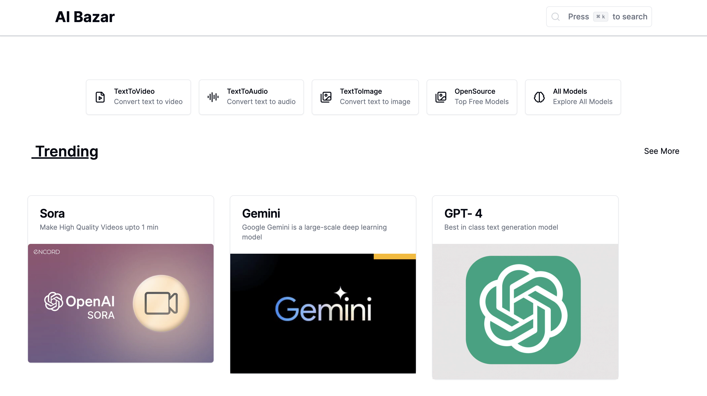
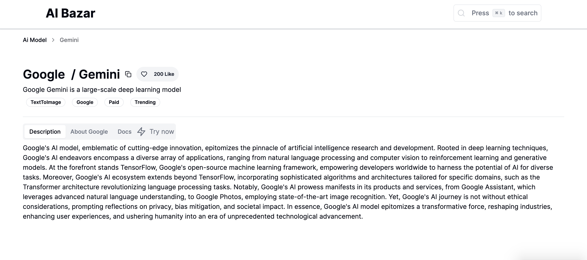
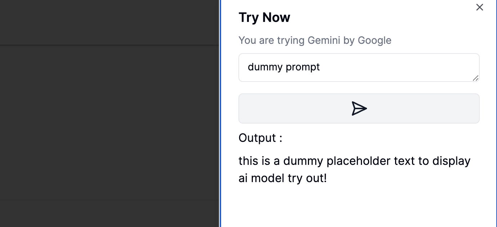
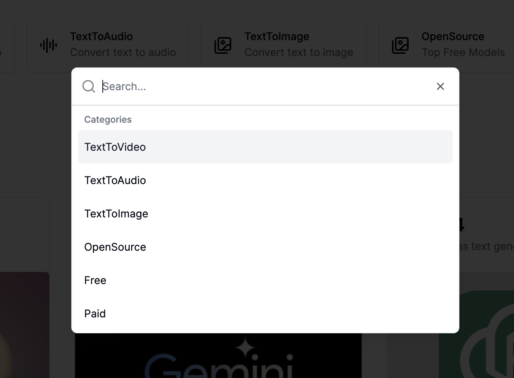
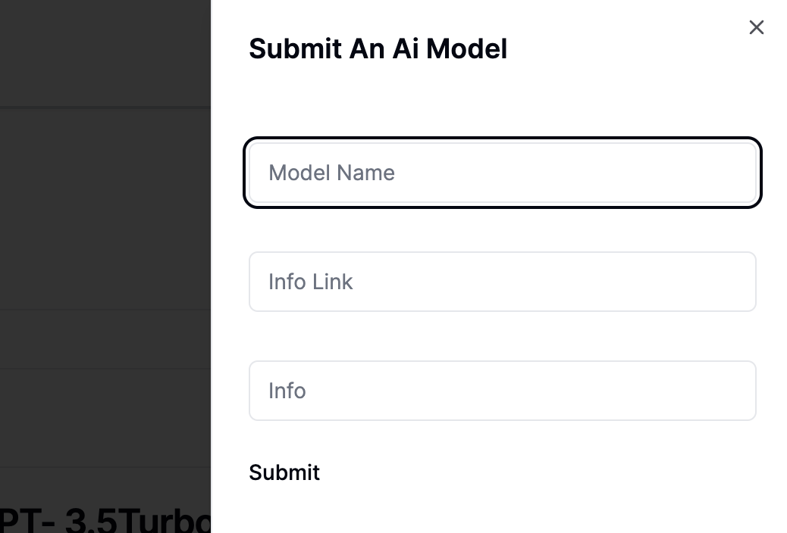
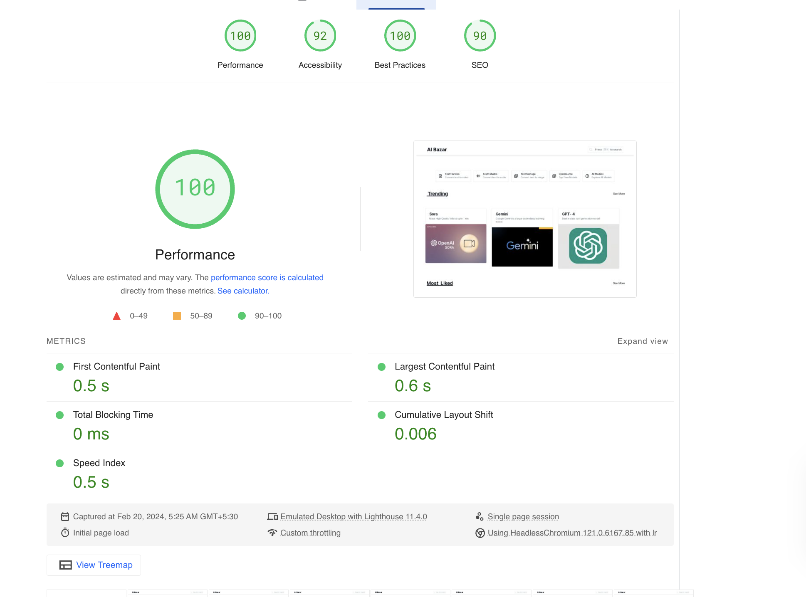

### Introducing ai-bazar   🐱


A simple market place to view and browse Ai model 
- Browser and view trending Ai - Models


- View A model

- Try it

- Browse and Search across various categories

- Search on the go

- Submit A new Model

- Load time  (0.6s🚀 ) 
measured using pagespeed.web.dev
used RSC and Next.js  to decrease the load time and increase performance

## 🚀 Demo

Try the App: [ai-bazar](https://www.ai-bazar.xyz/)
PageSpeed Report: [Report](https://pagespeed.web.dev/analysis/https-ai-bazar-vercel-app/5f1r6nht1z?form_factor=desktop)


## 🛠️ Installation Steps

1. Clone the repository

```bash
git clone https://github.com/tewarig/ai-bazar.git
```

2. Change the working directory

```bash
cd ai-bazar
```

3. Install dependencies

```bash
npm install
```

4. Create `.env` file in root and add your variables

```bash
NEXT_PUBLIC_BACKEND_URL="http://localhost:3000/"

```

5. Run the app

```bash
npm run dev
```

You are all set! Open [localhost:3000](http://localhost:3000/) to see the app.


## 🙏 Open Source libraries Used
- Next.js
- React-hook-Form
- Tailwind CSS
- Shadcn UI
- radix-ui
- ReactMarkDown
- lucide React
- Zod
- clsx
- cmdk
